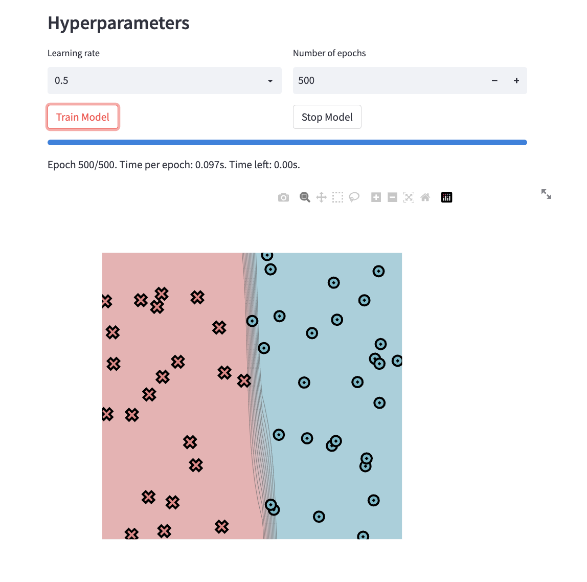
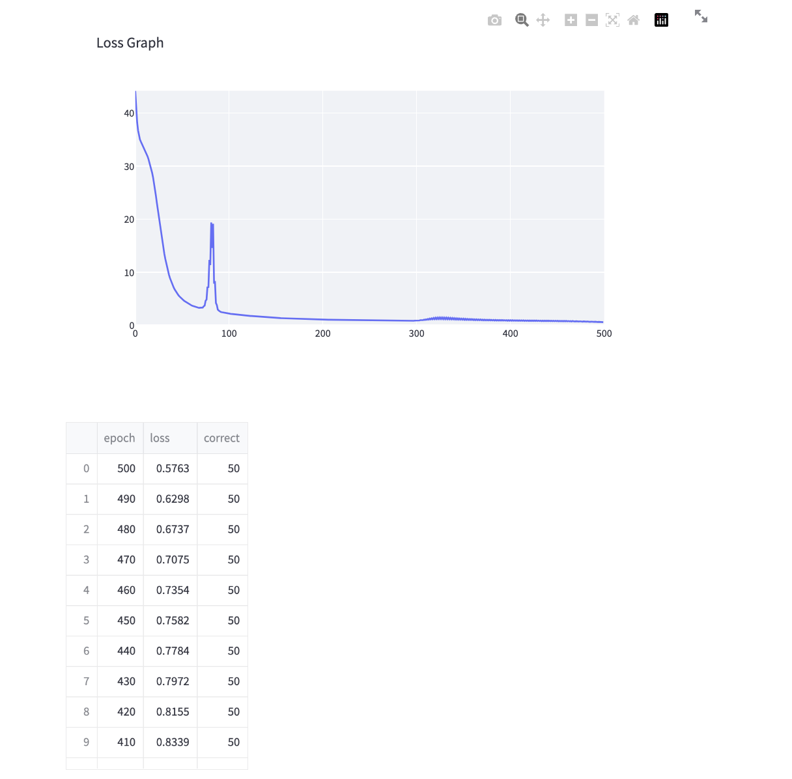
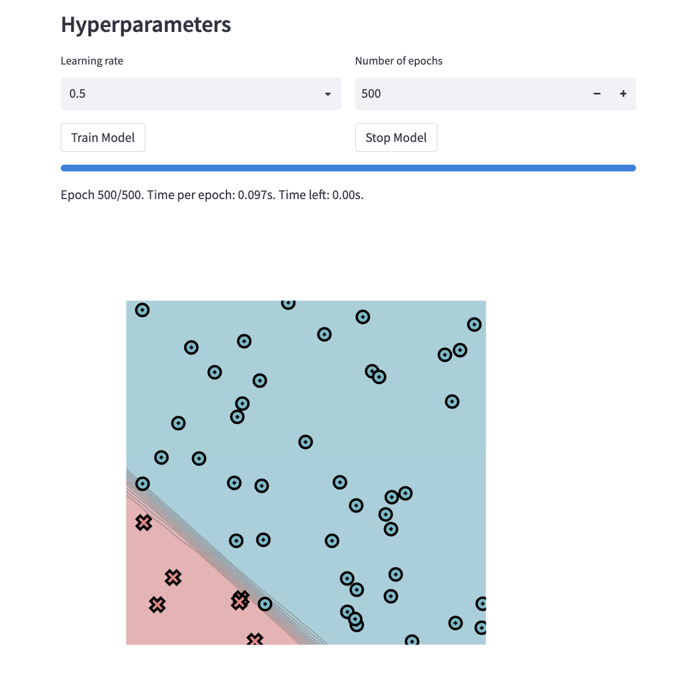
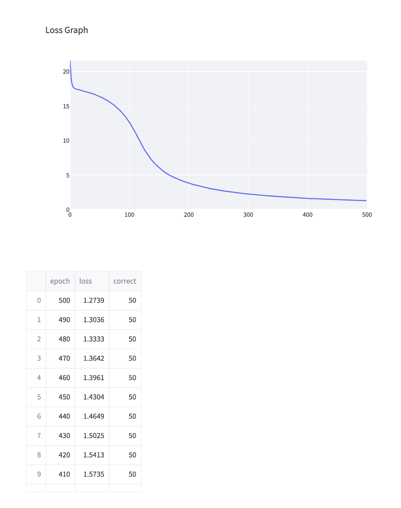
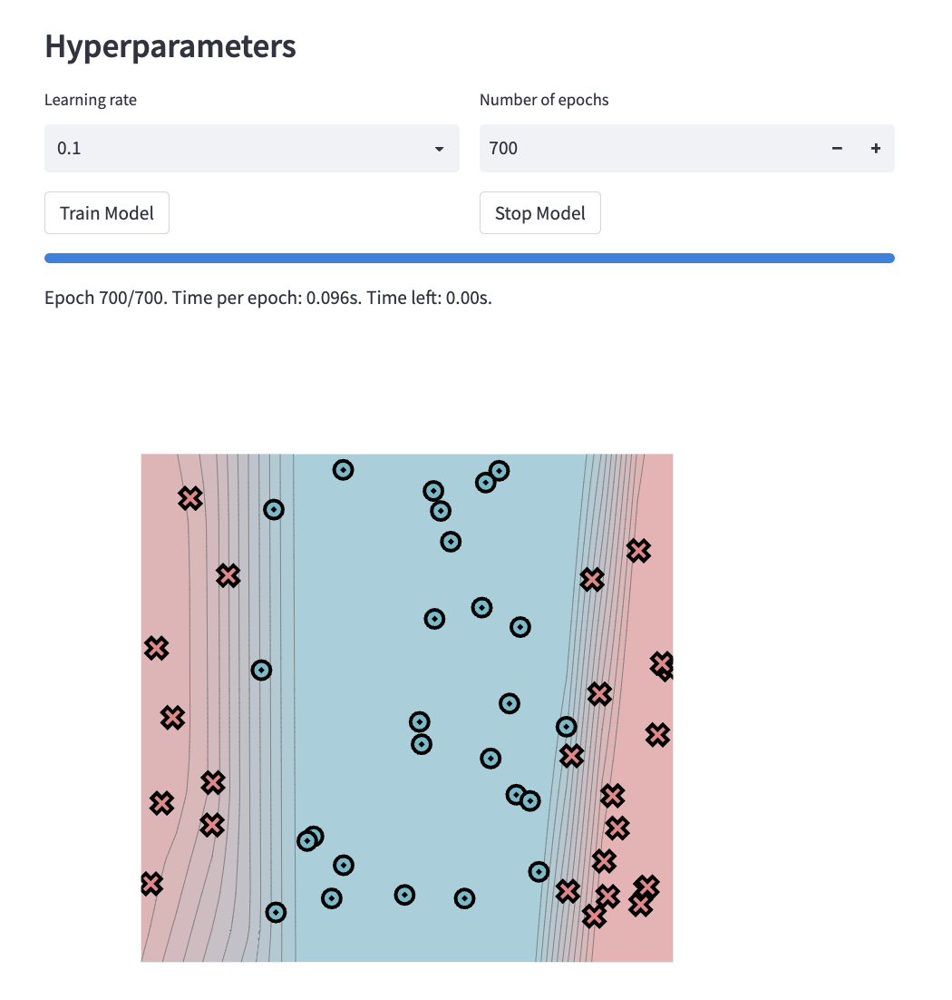
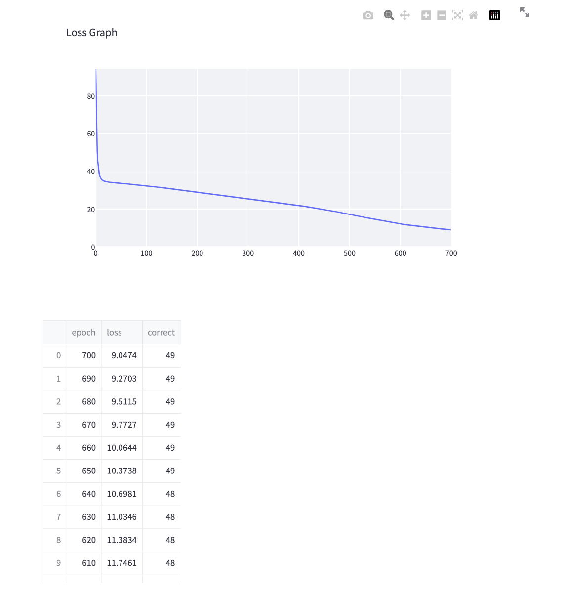
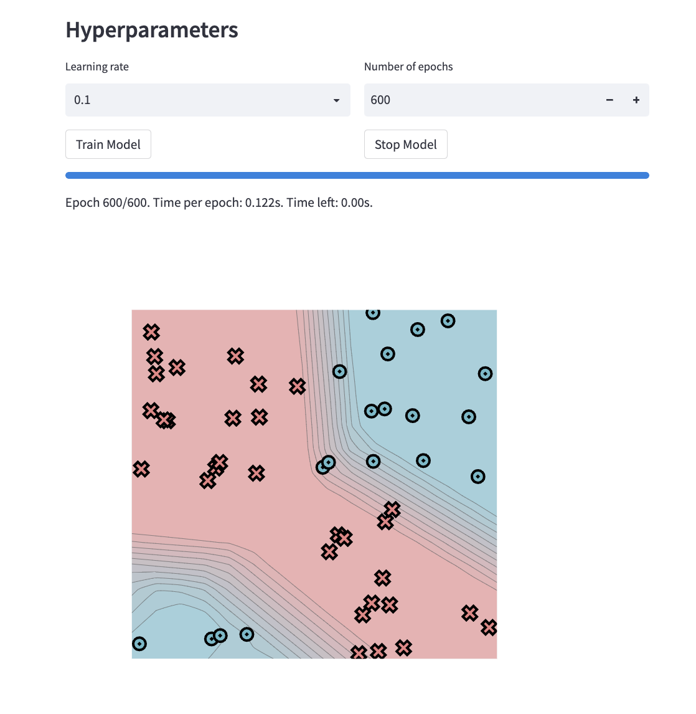
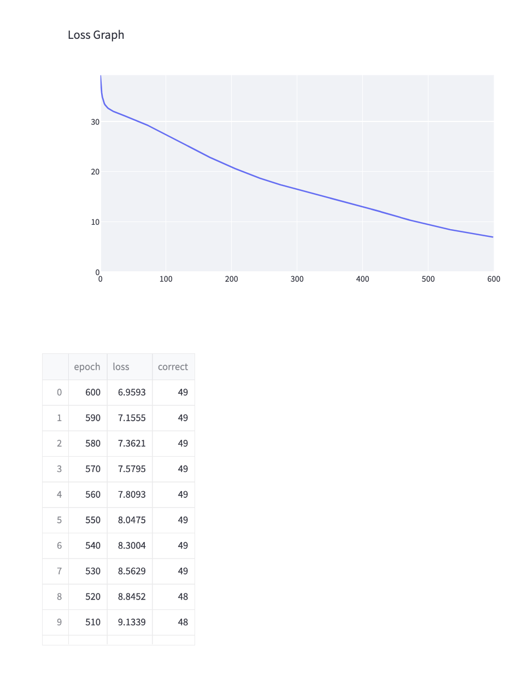

[](https://classroom.github.com/a/YFgwt0yY)
# MiniTorch Module 2


* Docs: https://minitorch.github.io/

* Overview: https://minitorch.github.io/module2/module2/

This assignment requires the following files from the previous assignments. You can get these by running

```bash
python sync_previous_module.py previous-module-dir current-module-dir
```

The files that will be synced are:

        minitorch/operators.py minitorch/module.py minitorch/autodiff.py minitorch/scalar.py minitorch/scalar_functions.py minitorch/module.py project/run_manual.py project/run_scalar.py project/datasets.py

Simple Dataset:

PTS = 50
HIDDEN = 5
RATE = 0.5
Epoch = 500
data = minitorch.datasets["Simple"](PTS)

Training Log:
Epoch: 0/500, loss: 0, correct: 0
Epoch: 0/500, loss: 0, correct: 0
Epoch: 0/500, loss: 0, correct: 0
Epoch: 0/500, loss: 0, correct: 0
Epoch: 0/500, loss: 0, correct: 0
Epoch: 10/500, loss: 33.5452193482775, correct: 39
Epoch: 20/500, loss: 27.871875758261094, correct: 42
Epoch: 30/500, loss: 15.618032761372417, correct: 47
Epoch: 40/500, loss: 7.905836883004355, correct: 49
Epoch: 50/500, loss: 5.083664473512318, correct: 49
Epoch: 60/500, loss: 3.835293755713514, correct: 49
Epoch: 70/500, loss: 3.2720275311124967, correct: 49
Epoch: 80/500, loss: 12.331319811352541, correct: 45
Epoch: 90/500, loss: 2.7721659477237046, correct: 49
Epoch: 100/500, loss: 2.22645676090971, correct: 49
Epoch: 110/500, loss: 1.9961815706545163, correct: 49
Epoch: 120/500, loss: 1.8185747799922416, correct: 50
Epoch: 130/500, loss: 1.6616477843776698, correct: 50
Epoch: 140/500, loss: 1.486893817138727, correct: 50
Epoch: 150/500, loss: 1.3892545422001217, correct: 50
Epoch: 160/500, loss: 1.309322334079334, correct: 50
Epoch: 170/500, loss: 1.24012152187606, correct: 50
Epoch: 180/500, loss: 1.1793214040505202, correct: 50
Epoch: 190/500, loss: 1.1253765032521683, correct: 50
Epoch: 200/500, loss: 1.077190291533144, correct: 50
Epoch: 210/500, loss: 1.0335472440301194, correct: 50
Epoch: 220/500, loss: 0.9935990183854784, correct: 50
Epoch: 230/500, loss: 0.9568474697136862, correct: 50
Epoch: 240/500, loss: 0.9229001011604694, correct: 50
Epoch: 250/500, loss: 0.8915234098087634, correct: 50
Epoch: 260/500, loss: 0.8627224219697807, correct: 50
Epoch: 270/500, loss: 0.8373396737030737, correct: 50
Epoch: 280/500, loss: 0.8186013078856083, correct: 50
Epoch: 290/500, loss: 0.8159983612865593, correct: 50
Epoch: 300/500, loss: 0.8584401041408389, correct: 50
Epoch: 310/500, loss: 0.9935397712547351, correct: 50
Epoch: 320/500, loss: 1.143814728676481, correct: 50
Epoch: 330/500, loss: 1.1583943202041236, correct: 50
Epoch: 340/500, loss: 1.1008233437146109, correct: 50
Epoch: 350/500, loss: 1.0407897946435547, correct: 50
Epoch: 360/500, loss: 0.9880375506733423, correct: 50
Epoch: 370/500, loss: 0.943807450944194, correct: 50
Epoch: 380/500, loss: 0.9052028474910762, correct: 50
Epoch: 390/500, loss: 0.8753799567440733, correct: 50
Epoch: 400/500, loss: 0.8529509739706679, correct: 50
Epoch: 410/500, loss: 0.8338742934451597, correct: 50
Epoch: 420/500, loss: 0.8155094551519113, correct: 50
Epoch: 430/500, loss: 0.7972295545327678, correct: 50
Epoch: 440/500, loss: 0.7783913527641796, correct: 50
Epoch: 450/500, loss: 0.7582122074643204, correct: 50
Epoch: 460/500, loss: 0.7353529604543798, correct: 50
Epoch: 470/500, loss: 0.7075143967475489, correct: 50
Epoch: 480/500, loss: 0.6737163757547548, correct: 50
Epoch: 490/500, loss: 0.6298482505750942, correct: 50
Epoch: 500/500, loss: 0.5763228836110055, correct: 50




Diag Dataset

PTS = 50
HIDDEN = 5
RATE = 0.5
Epoch = 500
data = minitorch.datasets["Diag"](PTS)

Training Log:
Epoch: 0/500, loss: 0, correct: 0
Epoch: 0/500, loss: 0, correct: 0
Epoch: 10/500, loss: 17.498184531903796, correct: 44
Epoch: 20/500, loss: 17.28230354350298, correct: 44
Epoch: 30/500, loss: 17.048012913199567, correct: 44
Epoch: 40/500, loss: 16.763316402300145, correct: 44
Epoch: 50/500, loss: 16.416489123360506, correct: 44
Epoch: 60/500, loss: 15.986536773183403, correct: 44
Epoch: 70/500, loss: 15.451713387338895, correct: 44
Epoch: 80/500, loss: 14.77536443564823, correct: 44
Epoch: 90/500, loss: 13.90327261800273, correct: 44
Epoch: 100/500, loss: 12.765733476439106, correct: 44
Epoch: 110/500, loss: 11.31555893753916, correct: 44
Epoch: 120/500, loss: 9.593709254589852, correct: 44
Epoch: 130/500, loss: 8.177016210739094, correct: 45
Epoch: 140/500, loss: 7.003413316141234, correct: 46
Epoch: 150/500, loss: 6.138914560260845, correct: 48
Epoch: 160/500, loss: 5.420255642470862, correct: 48
Epoch: 170/500, loss: 4.892681617773096, correct: 48
Epoch: 180/500, loss: 4.488971721831377, correct: 49
Epoch: 190/500, loss: 4.142701420311735, correct: 50
Epoch: 200/500, loss: 3.8428393984918623, correct: 50
Epoch: 210/500, loss: 3.5830623776902, correct: 50
Epoch: 220/500, loss: 3.3526761533138054, correct: 50
Epoch: 230/500, loss: 3.153100356507079, correct: 50
Epoch: 240/500, loss: 2.974060476000917, correct: 50
Epoch: 250/500, loss: 2.8179583113811146, correct: 50
Epoch: 260/500, loss: 2.679115425279041, correct: 50
Epoch: 270/500, loss: 2.5543084889943746, correct: 50
Epoch: 280/500, loss: 2.441699430810903, correct: 50
Epoch: 290/500, loss: 2.3397262459336408, correct: 50
Epoch: 300/500, loss: 2.24591021614047, correct: 50
Epoch: 310/500, loss: 2.1601684964795558, correct: 50
Epoch: 320/500, loss: 2.08095354788698, correct: 50
Epoch: 330/500, loss: 2.0066039718003044, correct: 50
Epoch: 340/500, loss: 1.9377108433124721, correct: 50
Epoch: 350/500, loss: 1.8726410901242525, correct: 50
Epoch: 360/500, loss: 1.811793042912233, correct: 50
Epoch: 370/500, loss: 1.755745283309664, correct: 50
Epoch: 380/500, loss: 1.6993410311026693, correct: 50
Epoch: 390/500, loss: 1.6481171980267844, correct: 50
Epoch: 400/500, loss: 1.597817539168509, correct: 50
Epoch: 410/500, loss: 1.573461396862536, correct: 50
Epoch: 420/500, loss: 1.5413381206168313, correct: 50
Epoch: 430/500, loss: 1.5025223763748858, correct: 50
Epoch: 440/500, loss: 1.4649251517464283, correct: 50
Epoch: 450/500, loss: 1.430364202502908, correct: 50
Epoch: 460/500, loss: 1.3961229825721324, correct: 50
Epoch: 470/500, loss: 1.364227700314261, correct: 50
Epoch: 480/500, loss: 1.3333361564516486, correct: 50
Epoch: 490/500, loss: 1.3036178171127175, correct: 50
Epoch: 500/500, loss: 1.2738943668444882, correct: 50




Split Dataset

PTS = 50
HIDDEN = 5
RATE = 0.1
Epoch = 700
data = minitorch.datasets["Split"](PTS)

Training Log:
Epoch: 10/700, loss: 36.78205707604735, correct: 26
Epoch: 20/700, loss: 34.65521064949884, correct: 26
Epoch: 30/700, loss: 34.15808805627157, correct: 30
Epoch: 40/700, loss: 33.879883620408116, correct: 30
Epoch: 50/700, loss: 33.647685846585645, correct: 31
Epoch: 60/700, loss: 33.41033512872589, correct: 32
Epoch: 70/700, loss: 33.17318135248845, correct: 32
Epoch: 80/700, loss: 32.925594856611546, correct: 32
Epoch: 90/700, loss: 32.666669680112115, correct: 33
Epoch: 100/700, loss: 32.39137004539895, correct: 34
Epoch: 110/700, loss: 32.0969193164253, correct: 34
Epoch: 120/700, loss: 31.783222548188107, correct: 34
Epoch: 130/700, loss: 31.45101827261609, correct: 34
Epoch: 140/700, loss: 31.103481130270772, correct: 34
Epoch: 150/700, loss: 30.744161989004372, correct: 34
Epoch: 160/700, loss: 30.3692236444381, correct: 34
Epoch: 170/700, loss: 29.988728840018553, correct: 34
Epoch: 180/700, loss: 29.61725376361244, correct: 34
Epoch: 190/700, loss: 29.25818466985632, correct: 35
Epoch: 200/700, loss: 28.91289814022421, correct: 36
Epoch: 210/700, loss: 28.576173640424027, correct: 36
Epoch: 220/700, loss: 28.244586776357075, correct: 36
Epoch: 230/700, loss: 27.910131571164662, correct: 36
Epoch: 240/700, loss: 27.584567529326833, correct: 36
Epoch: 250/700, loss: 27.261430982748436, correct: 36
Epoch: 260/700, loss: 26.92969138273326, correct: 36
Epoch: 270/700, loss: 26.608305514298717, correct: 36
Epoch: 280/700, loss: 26.291155753492824, correct: 36
Epoch: 290/700, loss: 25.966884942885805, correct: 37
Epoch: 300/700, loss: 25.628669446976787, correct: 37
Epoch: 310/700, loss: 25.278190087684237, correct: 38
Epoch: 320/700, loss: 24.916098546154508, correct: 38
Epoch: 330/700, loss: 24.57271991508455, correct: 38
Epoch: 340/700, loss: 24.225975141445772, correct: 38
Epoch: 350/700, loss: 23.86861556096534, correct: 39
Epoch: 360/700, loss: 23.502239367225766, correct: 39
Epoch: 370/700, loss: 23.125996921654146, correct: 39
Epoch: 380/700, loss: 22.744789067918706, correct: 39
Epoch: 390/700, loss: 22.35785642058811, correct: 39
Epoch: 400/700, loss: 21.96096542658329, correct: 39
Epoch: 410/700, loss: 21.552629916473272, correct: 39
Epoch: 420/700, loss: 21.129019289292845, correct: 39
Epoch: 430/700, loss: 20.69471827640712, correct: 40
Epoch: 440/700, loss: 20.24061102256974, correct: 40
Epoch: 450/700, loss: 19.77555368958385, correct: 40
Epoch: 460/700, loss: 19.30708970100833, correct: 40
Epoch: 470/700, loss: 18.82573754165648, correct: 40
Epoch: 480/700, loss: 18.332011641440545, correct: 40
Epoch: 490/700, loss: 17.82430391863918, correct: 40
Epoch: 500/700, loss: 17.288762517043534, correct: 40
Epoch: 510/700, loss: 16.735168238651344, correct: 40
Epoch: 520/700, loss: 16.185193571133286, correct: 40
Epoch: 530/700, loss: 15.637651768072452, correct: 42
Epoch: 540/700, loss: 15.105173479744584, correct: 43
Epoch: 550/700, loss: 14.576192584587064, correct: 44
Epoch: 560/700, loss: 14.049555801530442, correct: 44
Epoch: 570/700, loss: 13.529201147231861, correct: 45
Epoch: 580/700, loss: 13.018548285447494, correct: 48
Epoch: 590/700, loss: 12.542242340077006, correct: 48
Epoch: 600/700, loss: 12.135523006737372, correct: 48
Epoch: 610/700, loss: 11.746081000489196, correct: 48
Epoch: 620/700, loss: 11.383383999614376, correct: 48
Epoch: 630/700, loss: 11.034550433937344, correct: 48
Epoch: 640/700, loss: 10.698113368445865, correct: 48
Epoch: 650/700, loss: 10.37384518856748, correct: 49
Epoch: 660/700, loss: 10.064423242685315, correct: 49
Epoch: 670/700, loss: 9.772715703648558, correct: 49
Epoch: 680/700, loss: 9.511488548471172, correct: 49
Epoch: 690/700, loss: 9.270332383907684, correct: 49
Epoch: 700/700, loss: 9.047420947613315, correct: 49




Xor Dataset

PTS = 50
HIDDEN = 6
RATE = 0.1
Epoch = 600
data = minitorch.datasets["Xor"](PTS)

Training Log:
Epoch: 10/600, loss: 32.960467402962315, correct: 31
Epoch: 20/600, loss: 32.05943263979008, correct: 31
Epoch: 30/600, loss: 31.513022991130832, correct: 31
Epoch: 40/600, loss: 31.01754491359584, correct: 31
Epoch: 50/600, loss: 30.507210976135365, correct: 32
Epoch: 60/600, loss: 29.984585458339588, correct: 34
Epoch: 70/600, loss: 29.423279685728865, correct: 36
Epoch: 80/600, loss: 28.7783878475959, correct: 38
Epoch: 90/600, loss: 28.13404722797112, correct: 40
Epoch: 100/600, loss: 27.480914584792863, correct: 42
Epoch: 110/600, loss: 26.808701922800005, correct: 42
Epoch: 120/600, loss: 26.12089782271861, correct: 43
Epoch: 130/600, loss: 25.42235793427744, correct: 44
Epoch: 140/600, loss: 24.71373234701247, correct: 44
Epoch: 150/600, loss: 24.028173385996322, correct: 44
Epoch: 160/600, loss: 23.355017824057693, correct: 44
Epoch: 170/600, loss: 22.718741656806074, correct: 44
Epoch: 180/600, loss: 22.1009726559513, correct: 44
Epoch: 190/600, loss: 21.508553597973464, correct: 44
Epoch: 200/600, loss: 20.951452758744868, correct: 44
Epoch: 210/600, loss: 20.407989686294595, correct: 44
Epoch: 220/600, loss: 19.875052847367083, correct: 44
Epoch: 230/600, loss: 19.375526634859003, correct: 44
Epoch: 240/600, loss: 18.890647706300832, correct: 44
Epoch: 250/600, loss: 18.436025114975134, correct: 44
Epoch: 260/600, loss: 18.0099325839941, correct: 44
Epoch: 270/600, loss: 17.600222807208226, correct: 44
Epoch: 280/600, loss: 17.220319338306414, correct: 44
Epoch: 290/600, loss: 16.851420850647884, correct: 44
Epoch: 300/600, loss: 16.489335210376332, correct: 44
Epoch: 310/600, loss: 16.142694574827534, correct: 44
Epoch: 320/600, loss: 15.798961684213205, correct: 44
Epoch: 330/600, loss: 15.451820952574966, correct: 44
Epoch: 340/600, loss: 15.124232461695485, correct: 45
Epoch: 350/600, loss: 14.77646904354787, correct: 45
Epoch: 360/600, loss: 14.438168394926345, correct: 45
Epoch: 370/600, loss: 14.100624275193823, correct: 45
Epoch: 380/600, loss: 13.757550099422932, correct: 45
Epoch: 390/600, loss: 13.401396856277731, correct: 44
Epoch: 400/600, loss: 13.04258661233975, correct: 44
Epoch: 410/600, loss: 12.685279205420308, correct: 44
Epoch: 420/600, loss: 12.325031707016885, correct: 44
Epoch: 430/600, loss: 11.94582961746923, correct: 44
Epoch: 440/600, loss: 11.591936764685471, correct: 44
Epoch: 450/600, loss: 11.200323418831879, correct: 44
Epoch: 460/600, loss: 10.825761767599774, correct: 44
Epoch: 470/600, loss: 10.466686228501635, correct: 46
Epoch: 480/600, loss: 10.10009086292909, correct: 47
Epoch: 490/600, loss: 9.751075968087608, correct: 48
Epoch: 500/600, loss: 9.442730491505262, correct: 48
Epoch: 510/600, loss: 9.133878669626945, correct: 48
Epoch: 520/600, loss: 8.845244334373676, correct: 48
Epoch: 530/600, loss: 8.562938689728924, correct: 49
Epoch: 540/600, loss: 8.300420053315404, correct: 49
Epoch: 550/600, loss: 8.04745073886989, correct: 49
Epoch: 560/600, loss: 7.809289424617466, correct: 49
Epoch: 570/600, loss: 7.579460287132011, correct: 49
Epoch: 580/600, loss: 7.36205203232355, correct: 49
Epoch: 590/600, loss: 7.155516705825663, correct: 49
Epoch: 600/600, loss: 6.9593194360678945, correct: 49


